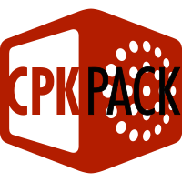

CPKPack 
===========


A minimal GUI program to extract contents from CRI Middleware's CPK archive format. (a.k.a. CRI Filemajik library)

Goals:  
- Clean codebase.  (Oops... -ltsophia)
- Minimalist.  (does minimal amount of work)
- No dependencies.  (entirely self contained in ~25KB library)
- High performance.  (really, really fast)

I wrote this library for my personal needs (i.e. for use with [CriFs.V2.Hook](https://github.com/Sewer56/CriFs.V2.Hook.ReloadedII) extensions).  
Does not support packing/repacking; if you need that functionality, fire a pull request 😇.  

What this library isn't:  
- General CRI Table Parser  (it skips any data it doesn't care about)

Feature Support
===============

- Decompression (CRILayla).  
- Header Decryption.  
- Custom User Decryption Functions.  


The provided GUI application is now more functional and user-friendly.

Usage
=====

## Normal Usage
Either open up a CPK archive file with this application or drag a CPK archive file onto this program while it is running.

Both methods will allow you to browse the files in the CPK archive as well as extract them.

## CLI Usage
If you would prefer to run this program from the command line, you can call the executable with both a input and output path.

This will have the program run without the gui, and fully unpack the file located at the input path, storing everything at the
output path.
#### Example CLI usage:
```bat
CPKPack.exe path/to/file.CPK path/to/output/folder/
```

Resources
=====

This code is based on the following previous projects.  

- Skyth (https://github.com/blueskythlikesclouds/MikuMikuLibrary/blob/dotnet/MikuMikuLibrary/Archives/CriMw/UtfTable.cs)  
- TGE (https://github.com/tge-was-taken/010-Editor-Templates/blob/master/releases/cri_archives/cri_archives_rel_1.bt)  
- CriPakTools by Falo, Nanashi3, esperknight, uyjulian & wmltogether (https://github.com/wmltogether/CriPakTools)

Building
=========
- Install .NET 7 SDK.
- Build with `dotnet build -c Release` 
or if you prefer an IDE, just open `CriFsV2Lib.sln`.

Credits
=========

- Aforementioned authors in 'Resources' section.  
- Lipsum/Zarroboogs (Original P5R Encryption function for reference)